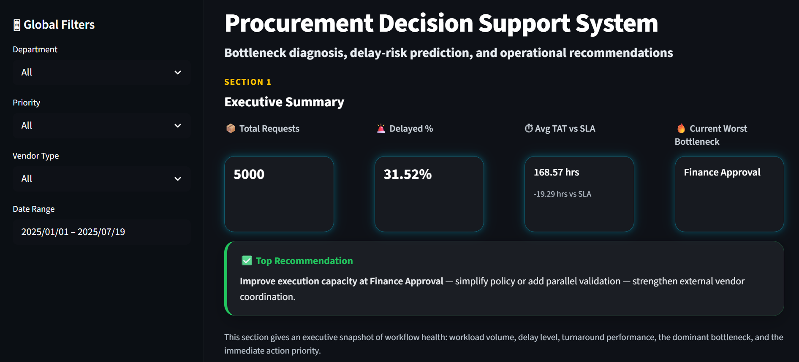
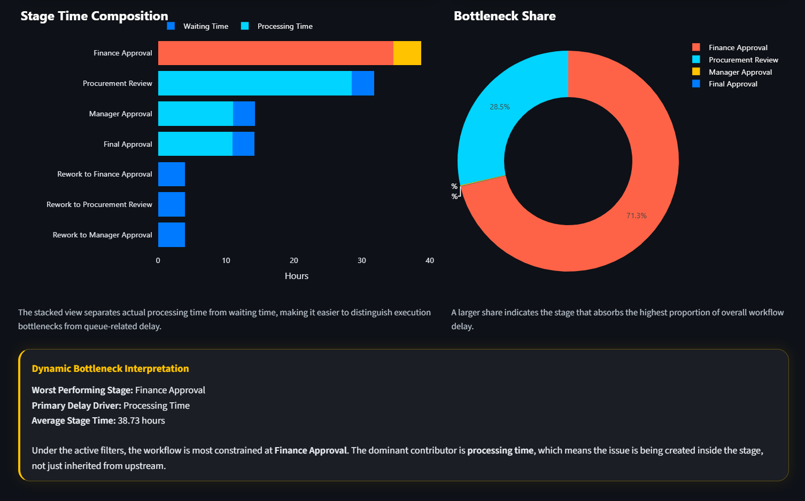
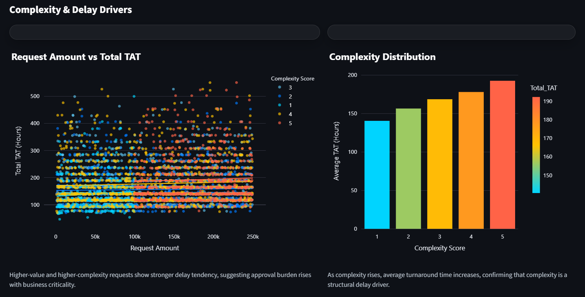
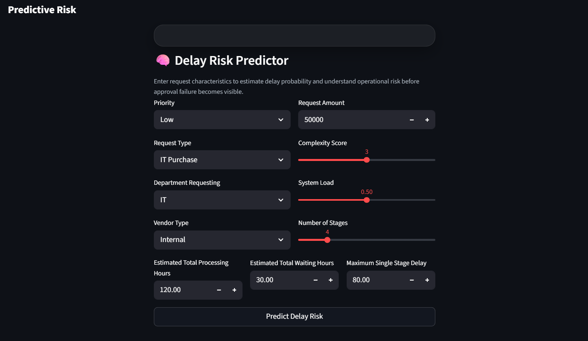

# Diagnosing Bottlenecks in Procurement Approval Processes

## Live Demo
[Open Interactive Dashboard](https://procurement-bottleneck-dashboard.streamlit.app/)

## Overview

This project analyzes delays in procurement approval workflows using a data-driven approach.

It focuses on identifying:
- where delays occur
- why delays occur
- which requests are at risk of delay

The project combines workflow analysis, bottleneck diagnostics, and predictive modeling to create a complete operational analytics solution.

---

## Problem Statement

Procurement approval processes often involve multiple sequential stages.

Delays can occur due to:
- inefficient coordination
- approval dependencies
- rework loops
- workload imbalance

However, these delays are rarely measured or diagnosed systematically.

This project aims to:
- detect bottlenecks
- quantify delay drivers
- predict delay risk

---

## Project Structure

```text
Procurement-Bottlenecks/
│
├── data/                   
│
├── notebooks/
│
├── src/
│
├── dashboard/              
│  
├── outputs/                
│ 
├── docs/
│
├── requirments.txt
│
└── README.md                
```
---

---

## Data Pipeline

The project follows a structured pipeline:

1. Synthetic Data Generation  
2. Data Processing and Feature Engineering  
3. Final Dataset Preparation  
4. Exploratory Data Analysis  
5. Bottleneck Analysis  
6. Predictive Modeling  
7. Dashboard Visualization  

---

## Key Components

### 1. Synthetic Data Generation
- Simulates procurement workflows
- Includes stage delays, waiting time, rework loops
- Generates realistic operational variability

---

### 2. Exploratory Data Analysis
- Turnaround time distribution
- Category-based comparisons
- Delay prevalence

---

### 3. Bottleneck Analysis
- Stage-wise delay contribution
- Bottleneck frequency
- Waiting vs processing dominance
- Department and vendor effects
- Delay concentration

---

### 4. Predictive Modeling
- Random Forest classifier
- Target: `Delayed_Flag`
- Leakage removed:
- Delay_Ratio
- SLA_Breach_Hours

Model performance:
- ~95% accuracy
- strong recall for delayed requests

---

### 5. Dashboard
Interactive Streamlit dashboard for:
- executive summary
- bottleneck visualization
- complexity analysis
- delay risk prediction

---

## Feature Importance

Top drivers of delay:

- Total Waiting Time  
- Maximum Stage Delay  
- Complexity Score  
- Number of Stages  
- Request Amount  

These features indicate that delays are driven by both workflow structure and request complexity.

---

## Dashboard Preview

### Executive Summary


### Bottleneck Analysis


### Complexity & Delay Drivers


### Delay Prediction


---

## Key Insights

- Delays are concentrated in specific workflow stages  
- Waiting time is a major contributor to delays  
- Rework significantly increases turnaround time  
- External vendors tend to increase delay risk  
- A single stage often dominates total delay  

---

## Business Value

This project enables:
- identification of operational bottlenecks
- targeted process improvement
- early detection of risky requests
- better decision-making in approval workflows

---

## Technologies Used

- Python
- Pandas
- NumPy
- Matplotlib
- Scikit-learn
- Streamlit

---

## How to Run

### 1. Install dependencies
```bash
pip install -r requirements.txt
```
### 2. Run Pipeline
```bash
python src/generate_data.py
python src/processing.py
python src/finalize_data.py
python src/modeling.py
```
### 3. Run dashboard
```bash
streamlit run dashboard/app.py
```

## Author

Saami Anware
